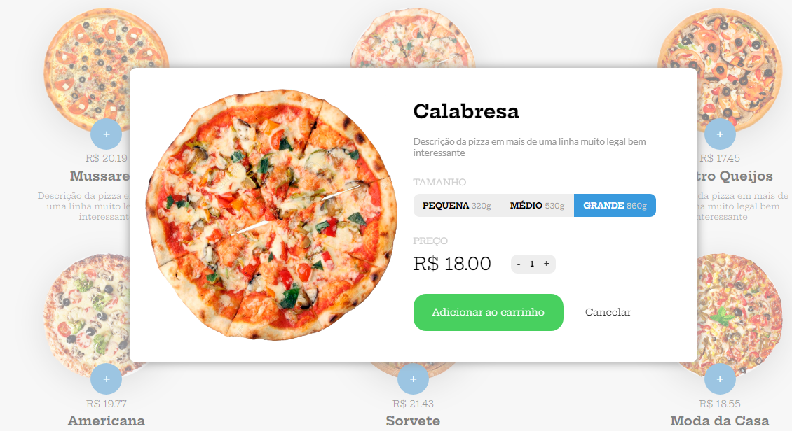
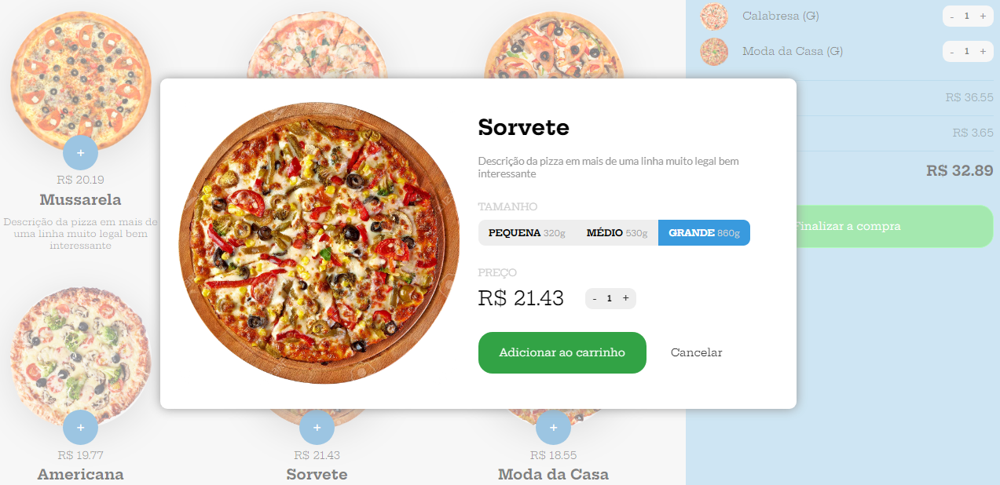
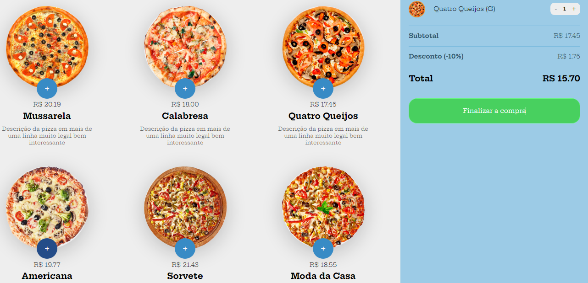
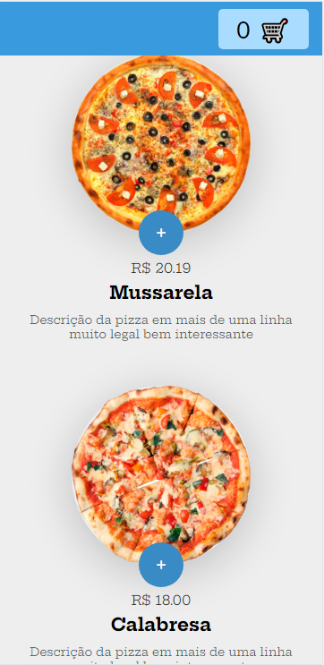
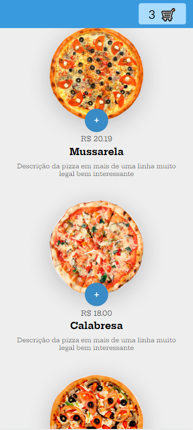
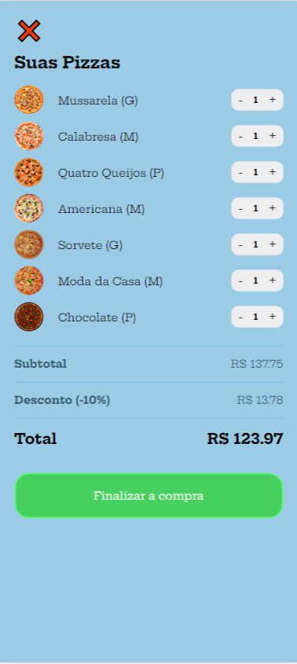

# PROJETO COMPRA DE PIZZA

Esse projeto foi o desenvolvimento de um mini sisteminha de vendas de pizzas, onde usamos o javascript puro.

Nesse projeto aprendemos a fazer o clone com o método `cloneNode()`

# Parâmetros:
    - cloneNode(true) | cloneNode(false) | cloneNode(deep)
Se `true`, então o nó e toda a sua subárvore, incluindo o texto que pode estar em `Text` nós filhos, também são copiados.

Se `false`, apenas o nó será clonado. A subárvore, incluindo qualquer texto contido no nó, não é clonada.

Observe que `deep` não tem efeito em elementos void , como os elementos `` e `<input>`.

Adicionando ou removendo uma classe na tag `HTML`:
 - `querySelector('div').classList.add('selected')`
 - `querySelector('div').classList.remove('selected')`

# 📱 ScreenShot

<h1 align="center">💻 Desenvolvido Por: Gilberto Júnior</h1>